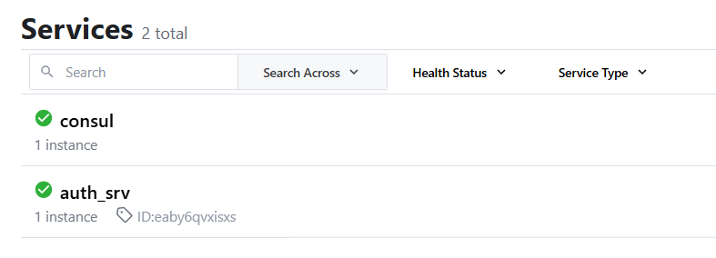

# rxdw-mall

## 服务分类

* auth 认证服务
* cart 购物车服务
* checkout 结算服务
* order 订单服务
* payment 支付服务
* product 商品服务
* user 用户服务

## 技术栈

Go+Kitex+Hertz+Consul+Gorm+MySQL+Redis+Jaeger+OpenTelemetry🚀️ 🚀️ 🚀️

[kItex和Hertz的doc](https://www.cloudwego.io/)

## 数据库表设计

## WebUI

[consul](http://121.40.228.214:8500/)

[minio](http://121.40.228.214:19001/)

[jaeger](http://121.40.228.214:16686/)

[prometheus](http://121.40.228.214:3000/)

## docker compose

Goland的docker compose会出问题 直接在linux上使用一下command

`docker compose -p <project_name> up <service_name>`
